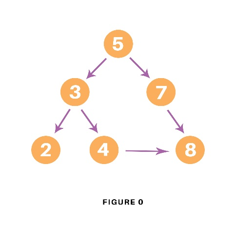

# Common algorithms

## Tree traversal.

A Tree Data Structure can be traversed in following ways:

Depth First Search or DFS

- Inorder Traversal
- Preorder Traversal
- Postorder Traversal

Level Order Traversal or Breadth First Search or BFS

- Boundary Traversal
- Diagonal Traversal

# Algorithms Descriptions

## DFS Tree

The Depth-First Search is a recursive algorithm that uses the concept of backtracking. It involves thorough searches of all the nodes by going ahead if potential, else by backtracking. Here, the word backtrack means once you are moving forward and there are not any more nodes along the present path, you progress backward on an equivalent path to seek out nodes to traverse. All the nodes are progressing to be visited on the current path until all the unvisited nodes are traversed after which subsequent paths are going to be selected.

